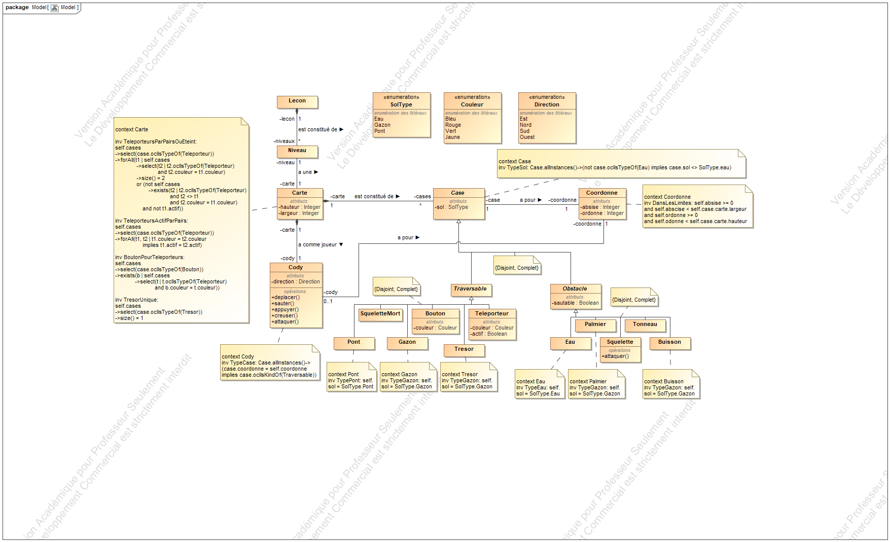

# amsi

University project

# OCL

All the OCL stuff is accessible in [this fine](ocl.md), it has indentation and comments.

# UML Class Diagram

This previous may not be accurate... Github does some kind of caching stuff

