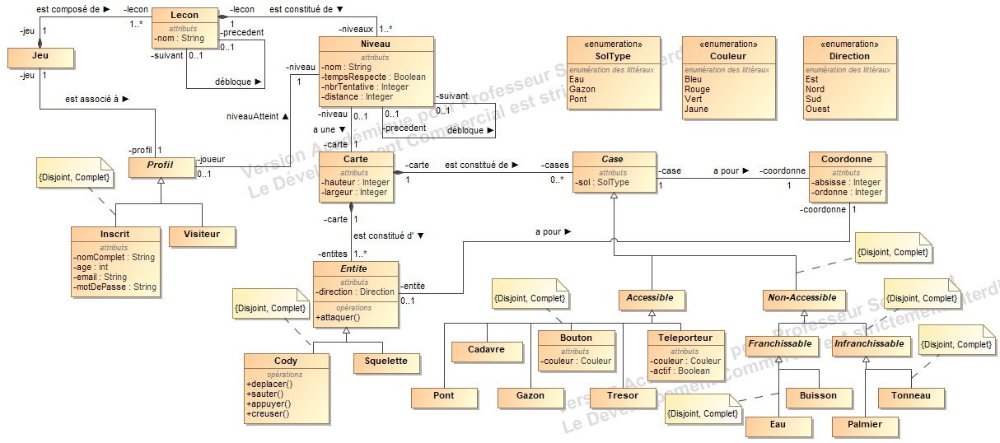
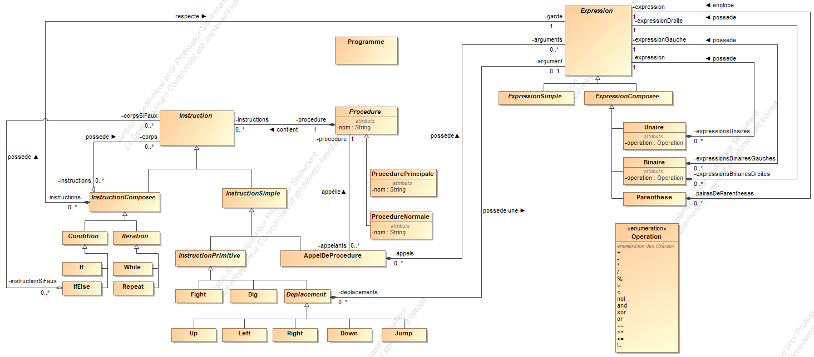

# amsi

University project

## Tools

The final report has been written in Markdown. Markdown is a simple text language that aim to be easy to read in a raw format.

Github as a markdown processor builtin, just open the file in github to see the content like any other rich text format.

Otherwise, you can generate a nice HTML output using pandoc:

	pandoc -o rapport.html -s --metadata pagetitle="AMSI" -c style.css rapport_janvier.md

## Diagram output

Due to github doing some image caching, the following diagrams may not be up to date

