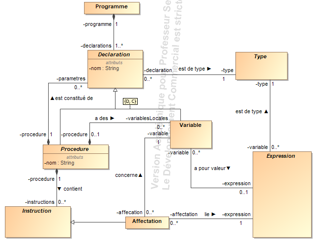
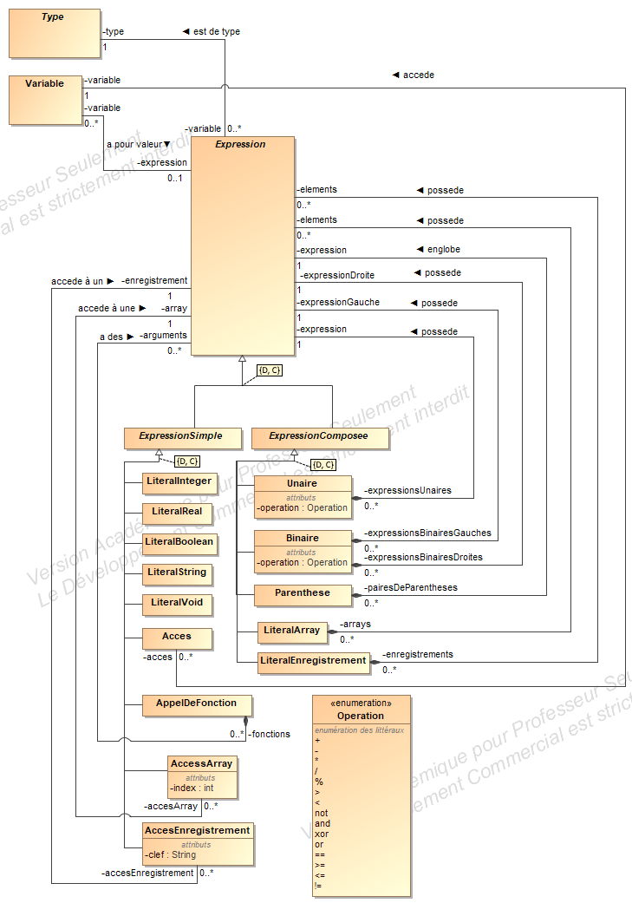

# AMSI

## Introduction

Dans le cadre du cours d'Analyse et Modélisation des Systèmes d'Information, il nous est demandé de réaliser l'analyse et la modélisation du jeu *Golden Quest* développé par la société Coding Park. Ce jeu présente un personnage (Cody) sur une île au trésor. Le joueur doit écrire une procédure informatique afin de déplacer Cody sur l'île pour l'amener au trésor.

Le jeu est donc constitué de deux parties importantes : l'interface visuelle (leçons, niveaux, plateaux de jeu) et l'interface de programmation (procédures, instructions, expressions).

## Modélisation du plateau de jeu

La carte est constitué de cases qui sont caractérisées par leurs coordonnées et leur nature (eau, gazon, pont). Les cases concrètes font toutes parties d'un des trois groupes suivants: les cases accessibles (sur lesquelles des entités peuvent évoluer), les obstacles franchissables (par dessus lesquels Cody peut sauter) et les obstacles infranchissables. La nature des cases est souvent forcée par la case concrète, on peut difficilement envisager un buisson sur un pont ou de l'eau.

Une Carte est associée à un Niveau qui est caractérisé par son nom ainsi que des statistiques relatives au score du joueur. Chaque niveau peut être suivi ou précédé par un autre niveau.

Un ensemble de Niveau constitue une Leçon, à leur tour caractérisées par un nom et pouvant être suivies ou précédées d'autres leçons.

Au final l'ensemble des Leçons constitue un jeu associé au profil d'un joueur dont la progression est définie par le dernier niveau qu'il a atteint. Le joueur peut être soit un visiteur soit un membre inscrit caractérisé par son nom, son age, son email et son mot de passe.

Les diagrammes de classes et d'objets ainsi que le niveau original se trouvent en annexe.

### Question 5.1

> Établir une première version d’un diagramme de classes Uml qui fixe les éléments principaux : le jeu est constitué d’une série de leçons découpées en niveaux.


### Question 5.2

> Enrichir cette première version avec les détails nécessaires concernant les joueurs et leurs profils, ainsi que les niveaux.


### Question 5.3

> Spécifier les contraintes suivantes, soit à l’aide d’éléments structurels dans le diagramme, éventuellement complétées  par  des  contraintes  en OCL.

1) Les coordonnées d'une case ne peuvent excéder les dimensions du niveau.

```
context Carte
inv DansLesLimites:
self.cases->forAll(
    case.absice >= 0
    and case.coordonne.absice < self.largeur
    and case.coordonne.ordonne >= 0
    and case.coordonne.ordonne < self.hauteur
)
```
 
2) Chaque niveau ne contient qu’un seul Cody, et qu’un seul coffre.

```
context Carte
inv TresorUnique:
self.cases->select(
    case | case.oclIsTypeOf(Tresor)
).size() = 1
```
```
context Carte
inv CodyUnique:
self.entites->select(
    entite | entite.oclIsTypeOf(Cody)
).size() = 1
```

3) Un personnage ne peut pas se trouver sur un obstacle.

```
context Entite
inv EntiteSurCaseAccessible: self.carte.cases.forAll->(
    case.coordonne = self.coordonne implies case.oclIsKindOf(Accessible)
)
```

4) Deux personnages ne peuvent pas partager la même case.

```
context Carte
inv CoordonneDesCasesUnique:
self.cases->forAll(
    c1, c2 | c1 <> c2 implies (c1.absice <> c2.absice or c1.ordonne <> c2.ordonne)
)
```

Chaque case de la carte a des coordonnées unique et il ne peut y avoir qu'au maximum une seule entité sur une case via l'unicité.

5) Le trésor doit se trouver sur du gazon.

```
context Tresor
inv TypeGazon: self.sol = SolType.Gazon
```

6) Un niveau doit toujours comporter deux tunnels de téléportation de même couleur, ou le tunnel unique doit être initialement fermé.

```
context Teleporteur
inv TeleporteursParPairOuEteint:
self.carte.cases->select(
    tele | tele.oclIsTypeOf(Teleporteur)
           and tele.couleur = self.couleur
).size() = 2
or (
    not self.carte.cases->exists(
        tele | tele.oclIsTypeOf(Teleporteur)
               and tele <> self
               and tele.couleur = self.couleur
    )
    and not self.actif
)
```

7) Un levier de téléportation ne peut être présent que s’il existe des tunnels de la même couleur.

```
context Bouton
inv BoutonMemeCouleurQueTeleporteur:
self.carte.cases->exists(
    tele | tele.oclIsTypeOf(Teleporteur)
           and tele.couleur = self.couleur
)
```

8) Les palmiers et les buissons doivent obligatoirement être posés sur du gazon (sinon, ils ne peuvent pas pousser).

```
context Buisson
inv TypeGazon: self.sol = SolType.Gazon
```
```
context Palmier
inv TypeGazon: self.sol = SolType.Gazon
```

### Question 5.4

1) Définir le niveau d´ecrit à l’aide d’un Diagramme d’Objets Uml, en cohérence avec le Diagramme de Classe obtenu au terme de la Question 5.2.


2) Quelle propriété du jeu n’est pas satisfaite par ce niveau ?

Le niveau n'est pas soluble. Cody n'a pas moyen de se déplacer à l'emplacement du trésor.

3) Est-il possible de définir une contrainte OCL qui permette de vérifier cette propriété ? Pourquoi ?

Non ce n'est pas possible de rédiger une contrainte OCL qui puisse vérifier qu'un niveau est soluble. Les contraintes OCL permettent de définir des contraintes entre des objets compte tenu du diagramme de classes auquel ils sont associés. Ce diagramme n'a aucune connaissance de la logique fonctionnelle d'un niveau.

On peut tout au plus vérifier que le trésor se trouve à l'emplacement actuel de cody ou à une distance d'une action de déplacement et que cody ne se trouve pas entre deux squelettes ou plus. Au delà de ces cas de base, une contrainte OCL n'est pas suffisante pour trouver un chemin allant de Cody au trésor.

## Modélisation de Play

Le langage utilisé dans le jeu est composé de procédures, elles-mêmes composées d'instructions qui font parfois appel à des expressions.

Il existe une procédure principale par programme, c'est celle qui est exécutée en premier et qui arrêtera le jeu une fois finie.

Chaque instruction peut être soit simple soit composée. Les instructions simples exécutent soit une procédure primitive existante dans GoldenQuest soit une procédure définie par l'utilisateur. Parmi les actions primitives, on différencie les actions de déplacement des autres. En effet les actions de déplacement admettent un paramètre optionnel (tout comme les procédures définies par l'utilisateur, si ce n'est que l'utilisateur peut définir autant de paramètres qu'il le souhaite) alors que les autres actions primitives n'ont pas de paramètre. Les instructions composées, quant à elles, regroupent une série d'autres instructions qui seront jouées 0, 1 ou plusieurs fois en fonction de l'expression associée à l'instruction composée. Parmi les instructions composées, on retrouve les conditions et les itérations.

Les expressions sont également simples ou composées. Les expressions simples sont des littéraux ou des variables tandis que les expressions composées permettent de regrouper ou d'effectuer des opérations sur d'autres expressions.

Les différents diagrammes se trouvent en annexe.

### Question 5.5

> Établir une première version d’un diagramme de classes Uml qui fixe les éléments principaux : un Program(me) Play est un ensemble de procédures (dont l’une est la procédure principale).


### Question 5.6

> Modéliser le concept de procédure à partir d’une classe Procedure.

Non répondu

### Question 5.7

Modéliser le concept d’expression comme indiqué en Section 3.3, à partir d’une classe Expression.


### Question 5.8

Modéliser le concept d’instruction comme indiqué en Section 3.2, à partir d’une classe Instruction (qui fera usage de la classe Expression).


### Question 5.9

> Spécifier les contraintes OCL suivantes

1) Les noms des paramètres d’une procédure sont uniques.

```
    context ProcedureNormale
    inv NomsParametresUniques:
    self.parametres.forAll -> (p1,p2 | p1 <> p2 implies p1.nom <> p2.nom)
```
2) Les noms des procédures sont uniques au sein d’un Program(me).

```
context Programme
inv NomProceduresUniques:
self.procedures.forAll->(p1,p2 | p1 <> p2 implies p1.nom <> p2.nom)
```

3) Au moins une procédure doit être nommée Cody.

```
context Programme
inv NomProcedureCody:
self.procedures.select->(p | p.nom = 'Cody').size() > 0
```

4) S’il n’y a qu’une seule procédure dans le programme, l’instruction `dig()` doit apparaître au moins une fois.

```
context Programme
pre: self.procedures.size() = 1
inv DigUneFois:
self.procedures.first()
    .instructions
    .any->(i | i.oclIsTypeOf(Dig))
```

### Question 5.10

> Les expressions et les instructions obéissent à des contraintes afin de garantir leur usage correct.

* Identifier et préciser, en langage naturel, quelle(s) contraintes il faut imposer aux instructions pour qu’elles soient correctes.

  - Les expressions passées en argument dans un appel de procédure doivent être du même type que celles déclarées en paramètre de la procédure.

* Même travail pour les expressions.

  - La contrainte explicitée au point précédent affecte également la classe Expression. Elles sont donc intimement liées.

* Indiquer quels éléments dans les questions de Play+ permettent de spécifier précisément ces contraintes.

  - Les éléments Type et Declaration qui sont liés aux Expressions vont permettre de spécifier cette contrainte OCL.

### Question 5.11

> Donnez le code play et le diagramme UML de ce code qui permet de terminer le niveau.


    procedure Cody() {
        right(2)
        fight()
        down()
        dig()
    }

> Modélisez le code obtenu dans un diagramme objet.


## Modélisation de Play+

### Question 5.12

> Définir, à l'aide de l'Editeur de Niveau, un niveau original permettant d'illustrer les concepts de boucles imbriquées, de portée de variables, et de récursivitée.


### Question 5.13

> Modéliser le concept de Type, constitué des types primitifs, des tableaux et des enregistrements. La modélisation doit pouvoir capturer tous les exemples données en §4.1.


### Question 5.14

> Modifier le détail d'un Program(me) afin qu'elle réponde à la nouvelle définition : un Program(me) est constituée d'un ensemble de déclarations (cf. Section 4.2), et modéliser le concept de Declaration.



### Question 5.15

> Modifier le détail du concept Instruction afin d'ajouter les nouveaux éléments définis en Section 4.3.


### Question 5.16

> Modifier le détail du concept Expression afin de refleter les modifications définis en Section 4.3.
 


### Question 5.17

> Spécifier une contrainte Ocl permettant de vérifier qu'une déclaration de type est bien formée :

1) la liste de champs d'un enregistrement est non-vide ;

```
context Enregistrement
inv listeChampsNonVide:
self.tuples->forAll(t | not OCLIsUndefined(t.nom))
```    
         
    
2) un tableau comporte au moins une dimension qui doit être strictement positive.

```
context Array
inv taillePositive: self.taille >= 0
```
    
### Question 5.18

> Spécifier une contrainte Ocl vérifiant l'unicité des déclarations au sein de leur contexte :
 
* Les noms de variables au sein d'une (instance d') Action;

Non répondu, quelle différence avec une variable locale ?
 
* les noms de variables déclarées au sein d'une procédure ;
 
```
context Procedure
inv variableLocalesUnique:
self.variablesLocales->forAll(
    v1, v2 | v1 <> v2 implies v1.nom <> v2.nom
)
```
 
* les noms de variables déclarées au sein d'un corps de procédure ;
 
Non répondu, quelle différence avec une variable locale ?
 
* les noms des champs au sein d'un enregistrement.

```
context Enregistrement
inv nomChampUnique:
self.tuples->forAll(
    t1, t2 | t1 <> t2 implies t1.nom <> t2.nom
)
```
 
### Question 5.19

> Spécifier en Ocl le contrat Ocl sur une opération type(exp : Expression) : Type qui renvoie le type d'une expression :

* Le type des littéraux est le type qui leur correspond (par exemple, true a pour type Booleen, 1 a pour type Entier, "aa" a pour type String) ;
 
```
context LiteralInteger
inv typeLiteralIntegerCorrect:
self.type.oclIsKindOf(Integer)

context LiteralString
inv typeLiteralStringCorrect:
self.type.oclIsKindOf(String)

context LiteralVoid
inv typeLiteralVoidCorrect:
self.type.oclIsKindOf(Void)

context LiteralReal
inv typeLiteralRealCorrect:
self.type.oclIsKindOf(Real)

context LiteralBoolean
inv typeLiteralBooleanCorrect:
self.type.oclIsKindOf(Boolean)


```
 
* Le type d'une expression unaire est lié au type de son opérateur, à condition que sa sous-expression corresponde (par exemple, -1 doit avoir une sous-expression de type entier ou réel, et not b impose que b soit de type booléen) ;
 
```
context Unaire
pre: self.type.oclIsTypeOf(Boolean)
def operateursBooleensUnaire: Bag(Operation) = {Operation.not}
inv expressionUnaireTypeBoolean:
self.type = self.expression.type AND operateursBooleensUnaire.any->(o | o = self.operation)
```
```
context Unaire
pre: self.type.oclIsTypeOf(Integer) or self.type.oclIsTypeOf(Real) 
def operateursNombresUnaire: Bag(Operation) = {Operation.+, Operation.-}
inv expressionUnaireTypeIntegerReal:
(self.expression.type.ocslIsTypeOf(Integer) OR self.expression.type.ocslIsTypeOf(Real)) AND operateursNombresUnaire.any->(o | o = self.operation)

```
 
* Le type d'une expression binaire est lié au type de son opérateur (similaire au cas unaire, à vous de trouver des exemples pertinents) ;
 
```
context Binaire
pre: self.type.oclIsTypeOf(Boolean)
def operateursBooleensBinaire: Bag(Operation) = {Operation.and, Operation.not, Operation.xor, Operation.or}
inv expressionBinaireTypeBooleen: 
self.type = self.expressionGauche AND self.type = self.expressionDroite AND operateursBooleensBinaire.any->(o | o.operation = self.operation)
```
```
context Binaire
pre: self.type.oclIsTypeOf(Integer) OR self.type.oclIsTypeOf(Real)
def operateursNombresBinaire: Bag(Operation) = {Operation.+, Operation.-, Operation.*, Operation./, Operation.%, Operation.<, Operation.>, Operation.<=, Operation.>=, Operation.==, Operation.!=}
inv expressionBinaireTypeIntegerReal: 
(self.expressionGauche.type.oclIsTypeOf(Integer) OR self.expressionGauche.type.oclIsTypeOf(Real)) 
AND 
(self.expressionDroite.type.oclIsTypeOf(Integer) OR self.expressionDroite.type.oclIsTypeOf(Real))
AND 
operateursBooleensBinaire->any(o | o.operation = self.operation)

```
 
* Le type d'une expression parenthésée est le type de sa sous-expression ;
 
```
context Parenthese
inv contrainteExpressionParenthesee:
self.type = expression.type
```
 
* Le type d'un accès à une variable est son type de déclaration ;
 
```
context Acces
inv contrainteAcces:
self.type = self.variable.type
```

* Le type d'une expression gauche correspondant à l'accès à un champ est le type de sa déclaration dans l'enregistrement ;

Non représenté sur le schéma global.

Un enregistrement serait représenté par une expression littérale (LiterayRecord) ayant le type Enregistrement et serait une spécification d’une expression composite. Cette expression composite serait composée d’autres expressions (ses paires: clé, valeur) pour lesquels la clé serait de type String et la valeur du type de la valeur associée au tuple dont le nom est la clé pour l’enregistrement associé.

L’accès à une valeur d’un enregistrement serait une expression simple ayant pour type, le type de la valeur du champ de l’enregistrement associé (association par un enregistrement littéral ou par une variable de type Enregistrement). Cet accès serait composée d’une clé, une expression simple de type String, devant exister dans l’enregistrement.

* Le type d'une expression gauche d'accès à une case de tableau est le type de déclaration du tableau.

Non représenté sur le schéma global.

Un tableau serait représenté par une expression litérale (LiteralArray) ayant le type Array et qui serait une spécification d’une expression composite. Cette expression composite serait composée d’autres expressions (ses éléments) tous du même type que le type associé au type Array du LiteralArray.

L’accès à un élément d’un tableau serait une expression simple ayant pour type le type des éléments de l’Array associé (association par un tableau littéral ou par une variable de type Array). Cet accès serait composé d’un indice, une expression simple de type Integer, devant se trouver dans les limites du tableau.

### Question 5.20

> Spécifier le contrat Ocl sur une opération estValide() : boolean qui vérifie qu'une instruction est valide :

* Les gardes des instructions composées doivent posséder un type booleen ;

```
context InstructionComposee
inv GardeBooleenne:
self.garde.type.oclIsTypeOf(Boolean)
```
 
* Les paramètres des instructions d'actions doivent être entier ;

```
context Deplacement
inv ArgumentEntier:
self.argument.type.oclIsTypeOf(Integer)
```
 
* Les parties gauche et droite d'une affectation doivent être de même type ;

```
context Affectation
inv VariableEtValeurOntLeMemeType:
self.expression.type = self.variable.type
```
 
* Le type de retour d'une procédure doit toujours être void.

```
context AppelDeProcedure
inv ProcedureTypeVoid
self.procedureAppelee.type.OclIsTypeOf(Void)
```
 
### Question 5.21
 
> Les instructions d'actions primitives de déplacement obéissent à une logique particulière en présence de certains éléments. En supposant l'existence d'une opération prec mouv() : Déplacement qui retourne la direction du dernier déplacement effectué, spécifier les contrats Ocl sur l'ensemble de ces instructions :

* Lorsqu'une telle instruction tente d'accéder une case où se trouve un obstacle, le déplacement n'est pas effectué ;

```
context Cody::prec_move(dir: Direction)
inv SeDeplaceSurUneCaseNonAccessible:
pre: not self.carte.cases->any(case |
    case.coordonne.abscisse = self.coordonne.abscisse + (
        dir = Direction.Est implies 1
        or dir = Direction.Ouest implies -1
        or (dir <> Direction.Est and dir <> Direction.Ouest) implies 0)
    and case.coordonne.ordonne = self.coordonne.ordonne + (
        dir = Direction.Sud implies 1
        or dir = Direction.Nord implies -1
        or (dir <> Direction.Sud and dir <> Direction.Nord) implies 0)
    and case.OclIsKindOf(Accessible))
post: self.coordonne = self.coordonne@pre
```

* Lorsqu'une telle instruction tente d'accéder une case où se trouve un tunnel, on ressort dans la case suivant le dernier mouvement à partir de l'autre tunnel ;
 
Non répondu
 
* Lorsqu'on saute dans une direction à partir d'une case, on se atterit deux cases plus loin dans la même direction ; s'il y a un obstacle dans la case suivante, on reste sur place.

Non répondu

### Question 5.22

> Donner le code Play+ permettant de résoudre votre niveau original défini dans la Question 5.12.

```

int deplacementB := 2

procedure Cody() {
    
    int deplacementA := 3
    int count := 0
	while(deplacementA > 0){
	    right(deplacementA)
	    fight()
	    while(deplacementB > 0){
	        down(deplacementB)
	        deplacementB = deplacementB-1
	    }
	    count = count + 1
	    deplacementB = 3-count
	    deplacementA = deplacementA-1
	}
	recursion(3)
}

procedure recursion(int x){
    if(x == 0){
        dig()
    }
    if(x == 1){
        right(x)
    }
    if(x == 2){
        down(x)
    }
    if(x == 3){
        left(x)
    }
    recursion(x-1)
}

```